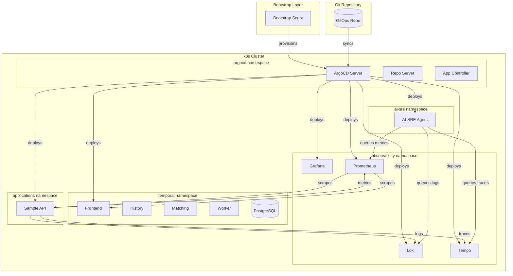
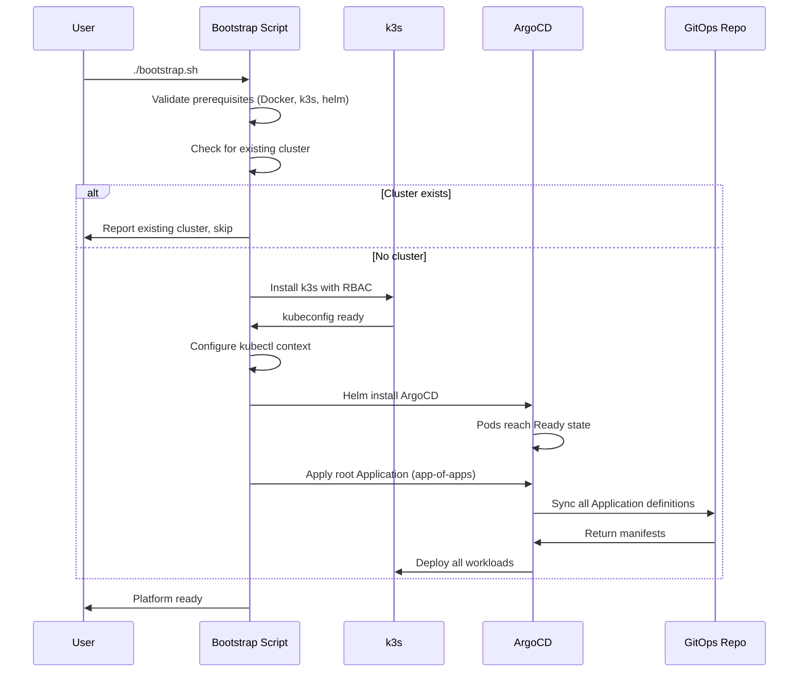
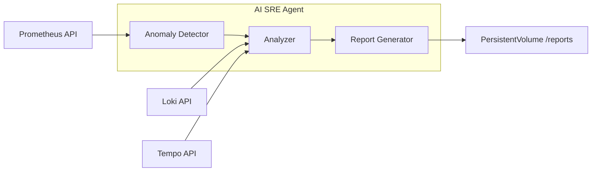

# Design Document: Local Platform Stack

## Overview

This design describes a production-grade local platform stack running on k3s that demonstrates a complete operational environment: GitOps-managed workloads via ArgoCD, full LGTM observability, Temporal workflow orchestration, a sample instrumented API, and an AI-powered SRE agent for automated root cause analysis.

The architecture follows a layered approach:
1. **Compute Layer** — k3s single-node cluster provisioned via bootstrap script
2. **GitOps Layer** — ArgoCD managing all workloads via app-of-apps pattern
3. **Observability Layer** — Grafana + Loki + Tempo + Prometheus (LGTM)
4. **Orchestration Layer** — Temporal server with workers
5. **Application Layer** — Sample API emitting full telemetry
6. **Intelligence Layer** — AI SRE agent performing automated RCA

### Design Decisions

| Decision | Choice | Rationale |
|----------|--------|-----------|
| Kubernetes distribution | k3s | Lightweight, single-binary, production-compatible API, runs on 4 cores/8GB |
| GitOps tool | ArgoCD | Industry standard, app-of-apps pattern, declarative sync |
| Observability stack | Individual Helm charts (not lgtm-distributed) | More control, better resource tuning for local env |
| Metrics backend | Prometheus (not Mimir) | Simpler for single-node, no object storage needed |
| Sample API language | Python (FastAPI) | Unified Python stack with AI SRE Agent, rich OTel support, rapid development |
| AI SRE implementation | Python + LangChain/LLM | Rich ecosystem for LLM tooling, easy PromQL/LogQL integration |
| Temporal persistence | SQLite/PostgreSQL (embedded) | No external DB dependency for local stack |
| Secret management | Kubernetes Secrets + RBAC | Sufficient for local assessment, avoids external vault |
| Failure injection | Shell scripts (not Chaos Mesh) | Zero additional infrastructure, idempotent, reviewable |

## Architecture

### High-Level Architecture Diagram



### Deployment Topology

The platform uses a namespace-per-concern isolation model:

| Namespace | Components | Purpose |
|-----------|-----------|---------|
| `argocd` | Server, Repo Server, App Controller, Redis | GitOps reconciliation |
| `observability` | Grafana, Loki, Tempo, Prometheus | Monitoring and alerting |
| `temporal` | Frontend, History, Matching, Worker, PostgreSQL | Workflow orchestration |
| `applications` | Sample API | Business workloads |
| `ai-sre` | AI SRE Agent, PVC for reports | Automated incident analysis |

### Bootstrap Sequence



## Components and Interfaces

### 1. Bootstrap Script (`bootstrap.sh`)

**Responsibility**: Provision k3s, install ArgoCD, apply root app-of-apps.

**Interface**:
```bash
# Execute
./bootstrap.sh

# Exit codes
# 0 - Success (provisioned or already exists)
# 1 - Prerequisite missing
# 2 - k3s provisioning failed
# 3 - ArgoCD installation failed
# 4 - Sync timeout
```

**Behavior**:
- Validates: Docker, k3s binary, helm CLI exist on PATH
- Checks for existing k3s cluster via `k3s kubectl cluster-info`
- Installs k3s with `--write-kubeconfig-mode 644 --disable traefik`
- Waits for node Ready + system pods Running (timeout 120s)
- Installs ArgoCD via Helm into `argocd` namespace
- Applies root Application pointing to `gitops/apps/` directory
- Waits for all child Applications to reach Synced+Healthy (timeout 300s)

### 2. ArgoCD GitOps Layer

**Pattern**: App-of-apps — a single root Application manages child Application resources.

**Repository Structure**:
```
gitops/
├── apps/                          # Root app-of-apps points here
│   ├── observability.yaml         # ArgoCD Application → observability
│   ├── temporal.yaml              # ArgoCD Application → temporal
│   ├── applications.yaml          # ArgoCD Application → applications
│   └── ai-sre.yaml               # ArgoCD Application → ai-sre
├── observability/
│   ├── grafana/
│   │   ├── Chart.yaml
│   │   ├── values.yaml
│   │   └── dashboards/
│   ├── loki/
│   │   ├── Chart.yaml
│   │   └── values.yaml
│   ├── tempo/
│   │   ├── Chart.yaml
│   │   └── values.yaml
│   └── prometheus/
│       ├── Chart.yaml
│       ├── values.yaml
│       └── rules/
│           ├── sli-slo.yaml
│           └── alerts.yaml
├── temporal/
│   ├── Chart.yaml
│   ├── values.yaml
│   └── workflows/
├── applications/
│   ├── sample-api/
│   │   ├── deployment.yaml
│   │   ├── service.yaml
│   │   └── servicemonitor.yaml
│   └── kustomization.yaml
├── ai-sre/
│   ├── deployment.yaml
│   ├── configmap.yaml
│   ├── pvc.yaml
│   └── kustomization.yaml
└── security/
    ├── network-policies/
    │   ├── observability-netpol.yaml
    │   ├── temporal-netpol.yaml
    │   ├── applications-netpol.yaml
    │   └── ai-sre-netpol.yaml
    ├── rbac/
    │   ├── serviceaccounts.yaml
    │   └── rolebindings.yaml
    └── resource-quotas/
```

**ArgoCD Application Spec (example)**:
```yaml
apiVersion: argoproj.io/v1alpha1
kind: Application
metadata:
  name: observability
  namespace: argocd
spec:
  project: default
  source:
    repoURL: <gitops-repo-url>
    targetRevision: main
    path: gitops/observability
  destination:
    server: https://kubernetes.default.svc
    namespace: observability
  syncPolicy:
    automated:
      prune: true
      selfHeal: true
    syncOptions:
      - CreateNamespace=true
```

### 3. LGTM Observability Stack

#### Prometheus

**Configuration**:
- Scrape interval: 15 seconds
- Service discovery: `kubernetes-pods` role with `prometheus.io/scrape: "true"` annotation filter
- Alert rules loaded from `rules/` directory
- Retention: 24h (sufficient for local demo)

**SLI/SLO Definition** (`rules/sli-slo.yaml`):
```yaml
apiVersion: monitoring.coreos.com/v1
kind: PrometheusRule
metadata:
  name: sample-api-slo
  namespace: observability
spec:
  groups:
    - name: sli
      rules:
        - record: sli:request_latency_p99
          expr: histogram_quantile(0.99, sum(rate(request_duration_seconds_bucket{service="sample-api"}[5m])) by (le))
    - name: slo-alerts
      rules:
        - alert: SLOLatencyBreach
          expr: sli:request_latency_p99 > 0.5
          for: 1m
          labels:
            severity: critical
          annotations:
            summary: "Sample API p99 latency exceeds 500ms SLO"
```

#### Loki

**Configuration**:
- Receives logs from all pods via Promtail DaemonSet
- Stores in local filesystem (no object storage for local stack)
- Retention: 24h
- Ingests JSON-structured logs, indexes on `namespace`, `pod`, `container`, `level`

#### Tempo

**Configuration**:
- Receives traces via OTLP gRPC (port 4317) and OTLP HTTP (port 4318)
- Backend: local filesystem storage
- Retention: 24h minimum
- Search enabled for trace lookup by service, operation, duration

#### Grafana

**Configuration**:
- Pre-provisioned datasources: Prometheus, Loki, Tempo
- Pre-provisioned dashboards via ConfigMap/sidecar:
  - **Sample API Overview**: request rate, error rate, p50/p95/p99 latency
  - **Platform Health**: node resources, pod status across namespaces
  - **Temporal Workflows**: execution rate, failure count, duration
- Anonymous access enabled (local-only, no auth needed for assessment)

### 4. Temporal Workflow Orchestration

**Architecture**:
```
┌─────────────┐     ┌──────────────────────────────────┐
│   Client    │────▶│         Frontend Service          │
└─────────────┘     └──────────────────────────────────┘
                              │
                    ┌─────────┼─────────┐
                    ▼                    ▼
          ┌─────────────┐      ┌─────────────┐
          │   History   │      │  Matching   │
          │   Service   │      │   Service   │
          └─────────────┘      └─────────────┘
                    │                    │
                    ▼                    ▼
          ┌──────────────────────────────────┐
          │          PostgreSQL               │
          └──────────────────────────────────┘
                              │
                    ┌─────────┴─────────┐
                    ▼                    
          ┌─────────────┐      
          │   Worker    │      
          │   Service   │      
          └─────────────┘      
```

**Deployment**: Temporal Helm chart with embedded PostgreSQL (no external DB dependency).

**Operational Workflow** — `HealthCheckWorkflow`:
- Purpose: Demonstrates durable execution + integrates with observability
- Steps: Query API health → Check Prometheus for recent errors → Report status
- Retry policy: max 3 attempts, 5s initial interval, 2.0 backoff coefficient
- Triggered via: `tctl workflow start` or REST trigger script

**Metrics Exposure**:
- Temporal server emits native Prometheus metrics at `:9090/metrics`
- Key metrics: `temporal_workflow_completed`, `temporal_workflow_failed`, `temporal_workflow_task_execution_latency`

### 5. Sample API Application

**Language**: Python (FastAPI)

**Endpoints**:

| Method | Path | Response | Purpose |
|--------|------|----------|---------|
| GET | `/health` | `{"status":"ok","timestamp":"...","request_id":"..."}` | Liveness/readiness probe |
| GET | `/api/v1/status` | `{"status":"ok","timestamp":"...","request_id":"...","uptime_seconds":N}` | Main instrumented endpoint |
| GET | `/metrics` | Prometheus exposition format | Metrics scraping |
| POST | `/api/v1/process` | `{"status":"processed","timestamp":"...","request_id":"...","duration_ms":N}` | Simulates downstream call with trace propagation |

**Telemetry Implementation**:
- **Metrics**: `prometheus-client` library exposing `request_count`, `request_duration_seconds`, `error_count`
- **Traces**: OpenTelemetry Python SDK, OTLP gRPC exporter to Tempo, W3C Trace Context propagation
- **Logs**: `structlog` structured JSON to stdout with `timestamp`, `level`, `message`, `trace_id`, `span_id`

**Resilience**:
- If Tempo/Prometheus backends unreachable: log warning, continue serving requests
- Non-blocking telemetry export with bounded queue (BatchSpanProcessor max_queue_size=1000)

**Pod Spec**:
```yaml
resources:
  requests:
    cpu: 50m
    memory: 64Mi
  limits:
    cpu: 200m
    memory: 128Mi
livenessProbe:
  httpGet:
    path: /health
    port: 8080
  initialDelaySeconds: 5
  periodSeconds: 10
  timeoutSeconds: 3
readinessProbe:
  httpGet:
    path: /health
    port: 8080
  initialDelaySeconds: 5
  periodSeconds: 10
  timeoutSeconds: 3
```

### 6. AI SRE Agent

**Language**: Python

**Architecture**:


**Detection Loop**:
1. Poll Prometheus every 30s for metric anomalies (error rate spike, latency deviation from baseline)
2. On anomaly detection, log detection event with deviating metric name
3. Trigger analysis pipeline

**Analysis Pipeline**:
1. Query Prometheus for metric deviations in detection window (±5 min)
2. Query Loki for error logs matching affected services in same window
3. Query Tempo for traces exceeding baseline p99 latency
4. Feed gathered evidence to LLM for root cause hypothesis generation

**LLM Integration**:
- Model: Configurable via environment variable (default: `gpt-4o-mini` via OpenAI API, or local Ollama)
- Prompt template includes: metric data, log excerpts, trace summaries, known failure patterns
- Structured output parsing for consistent RCA report format

**Report Output**:
- Written to PVC at `/reports/{timestamp}-{incident-id}.md`
- Also logged to stdout for Loki ingestion

### 7. Failure Injection Scripts

**Scripts** (in `scripts/` directory):

| Script | Target | Mechanism |
|--------|--------|-----------|
| `inject-pod-kill.sh` | Sample API pod | `kubectl delete pod` with label selector |
| `inject-latency.sh` | Sample API | Patches deployment with sleep sidecar or env var triggering artificial delay (≥2s) |
| `inject-resource-pressure.sh` | Sample API | Deploys stress container consuming 80%+ of pod CPU/memory limits |

Each script:
- Single command execution, no parameters required
- Outputs confirmation message with injection type and target
- Includes `--cleanup` flag to revert changes
- Idempotent: safe to run multiple times

## Data Models

### RCA Report Schema

```json
{
  "$schema": "http://json-schema.org/draft-07/schema#",
  "title": "RCAReport",
  "type": "object",
  "required": ["id", "timestamp", "status", "timeline", "affected_services", "symptoms", "root_cause", "evidence", "remediation"],
  "properties": {
    "id": {
      "type": "string",
      "description": "Unique report identifier (UUID)"
    },
    "timestamp": {
      "type": "string",
      "format": "date-time",
      "description": "ISO 8601 timestamp of report generation"
    },
    "status": {
      "type": "string",
      "enum": ["conclusive", "inconclusive"],
      "description": "Whether root cause was determined"
    },
    "timeline": {
      "type": "array",
      "items": {
        "type": "object",
        "required": ["timestamp", "event"],
        "properties": {
          "timestamp": { "type": "string", "format": "date-time" },
          "event": { "type": "string" },
          "source": { "type": "string", "enum": ["prometheus", "loki", "tempo", "agent"] }
        }
      }
    },
    "affected_services": {
      "type": "array",
      "items": { "type": "string" }
    },
    "symptoms": {
      "type": "array",
      "items": { "type": "string" }
    },
    "root_cause": {
      "type": "object",
      "required": ["hypothesis", "confidence"],
      "properties": {
        "hypothesis": { "type": "string" },
        "confidence": { "type": "string", "enum": ["high", "medium", "low"] },
        "category": { "type": "string", "enum": ["pod_termination", "latency_injection", "resource_pressure", "unknown"] }
      }
    },
    "evidence": {
      "type": "object",
      "properties": {
        "metrics": { "type": "array", "items": { "type": "string" } },
        "logs": { "type": "array", "items": { "type": "string" } },
        "traces": { "type": "array", "items": { "type": "string" } }
      }
    },
    "remediation": {
      "type": "array",
      "items": { "type": "string" }
    }
  }
}
```

### Sample API Response Model

```json
{
  "status": "ok",
  "timestamp": "2024-01-15T10:30:00Z",
  "request_id": "req-abc123",
  "uptime_seconds": 3600
}
```

### Sample API Log Entry Model

```json
{
  "timestamp": "2024-01-15T10:30:00.123Z",
  "level": "INFO",
  "message": "Request processed successfully",
  "trace_id": "4bf92f3577b34da6a3ce929d0e0e4736",
  "span_id": "00f067aa0ba902b7",
  "request_id": "req-abc123",
  "method": "GET",
  "path": "/api/v1/status",
  "duration_ms": 12,
  "status_code": 200
}
```

### Temporal Workflow Definition

```python
# HealthCheckWorkflow definition
@dataclass
class HealthCheckInput:
    target_service: str  # e.g., "sample-api"
    check_type: str      # "http", "metrics", "full"

@dataclass
class HealthCheckResult:
    service: str
    status: str       # "healthy", "degraded", "unhealthy"
    timestamp: str = ""
    details: dict = field(default_factory=dict)
    error_count: int = 0
```

### Network Policy Model

```yaml
# Default deny template applied per namespace
apiVersion: networking.k8s.io/v1
kind: NetworkPolicy
metadata:
  name: default-deny-ingress
  namespace: <managed-namespace>
spec:
  podSelector: {}
  policyTypes:
    - Ingress
---
# Selective allow example: Prometheus → applications
apiVersion: networking.k8s.io/v1
kind: NetworkPolicy
metadata:
  name: allow-prometheus-scrape
  namespace: applications
spec:
  podSelector:
    matchLabels:
      app: sample-api
  ingress:
    - from:
        - namespaceSelector:
            matchLabels:
              name: observability
          podSelector:
            matchLabels:
              app: prometheus
      ports:
        - port: 8080
          protocol: TCP
```

## Correctness Properties

*A property is a characteristic or behavior that should hold true across all valid executions of a system — essentially, a formal statement about what the system should do. Properties serve as the bridge between human-readable specifications and machine-verifiable correctness guarantees.*

### Property 1: API Response Contract

*For any* valid HTTP request to the Sample API status endpoint, the JSON response SHALL contain the fields `status` (non-empty string), `timestamp` (valid ISO 8601 format), and `request_id` (non-empty unique string).

**Validates: Requirements 5.1**

### Property 2: Structured Log Completeness

*For any* HTTP request processed by the Sample API, the resulting structured JSON log entry SHALL contain all required fields: `timestamp` (ISO 8601), `level` (one of DEBUG, INFO, WARN, ERROR), `message` (non-empty string), `trace_id` (32-character hex string), and `span_id` (16-character hex string).

**Validates: Requirements 5.2**

### Property 3: Metrics Counter Accuracy

*For any* sequence of N valid HTTP requests sent to the Sample API, the `request_count` metric exposed at `/metrics` SHALL increase by exactly N, and the `request_duration_seconds` histogram SHALL contain exactly N additional observations.

**Validates: Requirements 5.4**

### Property 4: Trace Context Propagation

*For any* inbound HTTP request to the Sample API that includes a valid W3C `traceparent` header, all downstream HTTP calls made during request processing SHALL include a `traceparent` header with the same trace-id and an updated parent-id.

**Validates: Requirements 5.7**

### Property 5: RCA Report Structural Completeness

*For any* RCA report produced by the AI SRE Agent (whether conclusive or inconclusive), the report SHALL contain all required fields: `timeline` (non-empty array of timestamped events), `affected_services` (non-empty array), `symptoms` (non-empty array), `root_cause` (object with hypothesis and confidence), `evidence` (object with metrics, logs, and traces arrays), and `remediation` (array of steps).

**Validates: Requirements 6.3**

### Property 6: Default-Deny Network Policy Coverage

*For any* managed namespace in the platform (observability, temporal, applications, ai-sre), there SHALL exist a NetworkPolicy resource with an empty `podSelector` (selecting all pods) and `policyTypes` including `Ingress`, effectively denying all inbound traffic by default.

**Validates: Requirements 7.1**

### Property 7: Secret Namespace Isolation

*For any* Kubernetes Secret in a managed namespace, the RBAC configuration SHALL permit read access (`get`, `list`, `watch` verbs on the `secrets` resource) only to ServiceAccounts within the same namespace that owns the Secret.

**Validates: Requirements 7.3**

### Property 8: Universal Resource Limits

*For any* pod deployed in any managed namespace (observability, temporal, applications, ai-sre), the pod specification SHALL define both CPU and memory resource `requests` and `limits` with non-zero values.

**Validates: Requirements 3.9, 5.5, 7.4**

### Property 9: Scoped RBAC Without Wildcards

*For any* ServiceAccount in a managed namespace, it SHALL be bound via a RoleBinding (not ClusterRoleBinding) to a Role that contains no wildcard (`*`) entries in either `verbs` or `resources` fields.

**Validates: Requirements 7.5**

### Property 10: Failure Injection Idempotency

*For any* failure injection script in the platform, executing it N times (where N ≥ 1) followed by its cleanup command SHALL return the cluster to a state indistinguishable from the pre-injection state, with all affected pods returning to Ready status within 30 seconds of cleanup.

**Validates: Requirements 9.5**


## Error Handling

### Bootstrap Script Error Handling

| Failure Mode | Detection | Behavior | Exit Code |
|-------------|-----------|----------|-----------|
| Missing prerequisite (Docker, k3s, helm) | `which` check on PATH | Output missing tool + install URL, exit immediately | 1 |
| k3s provisioning timeout (>120s) | Polling loop with deadline | Output "k3s failed to reach Ready state", print last kubelet log lines | 2 |
| ArgoCD install failure | Helm exit code + pod status check | Output ArgoCD pod statuses, print events | 3 |
| ArgoCD sync timeout (>300s) | App status polling with deadline | Output list of non-Synced applications with their conditions | 4 |
| Cluster already exists | `k3s kubectl cluster-info` succeeds before provisioning | Report existing cluster, exit success | 0 |

### Sample API Error Handling

| Failure Mode | Detection | Behavior |
|-------------|-----------|----------|
| Tempo unreachable | OTLP export returns connection error | Log warning, buffer spans in bounded queue (1000 spans), continue serving |
| Prometheus scrape fails | N/A (pull model — Prometheus scrapes API) | No action needed; API always exposes /metrics |
| Downstream service timeout | httpx timeout exception | Return 504 to caller, log error with trace context, increment error_count |
| Invalid request | Request validation (Pydantic) | Return 422 with error description, log at WARN level |
| Unhandled exception | FastAPI exception handler | Return 500, log at ERROR with traceback, increment error_count |

### AI SRE Agent Error Handling

| Failure Mode | Detection | Behavior |
|-------------|-----------|----------|
| Prometheus API unreachable | HTTP connection timeout (10s) | Log error, retry 3x with exponential backoff, mark metric evidence as "unavailable" |
| Loki API unreachable | HTTP connection timeout (10s) | Log error, retry 3x, mark log evidence as "unavailable" |
| Tempo API unreachable | HTTP connection timeout (10s) | Log error, retry 3x, mark trace evidence as "unavailable" |
| LLM API error/timeout | API response code != 200 or timeout (60s) | Retry 2x, fall back to rule-based hypothesis if LLM unavailable |
| Cannot determine root cause | Low confidence score from LLM analysis | Produce "inconclusive" report with all gathered evidence |
| PVC write failure | OS file write error | Log error, output report to stdout as fallback |

### Temporal Workflow Error Handling

| Failure Mode | Detection | Behavior |
|-------------|-----------|----------|
| Activity timeout | Activity execution exceeds StartToClose timeout | Retry per policy (3 attempts, 5s interval, 2.0 backoff) |
| All retries exhausted | RetryState = MaximumAttempts | Mark workflow as Failed, record failure reason in history |
| Worker disconnect | Temporal server heartbeat timeout | Temporal reassigns task to another worker (built-in) |
| Database connection loss | PostgreSQL connection error | Temporal server enters degraded mode, retries connection |

### ArgoCD Error Handling

| Failure Mode | Detection | Behavior |
|-------------|-----------|----------|
| Git repo unreachable (>300s) | Repository connection probe failure | Set condition on affected Applications, emit K8s event |
| Sync failure (invalid manifest) | kubectl apply error | Set Application to Degraded, emit event with error detail |
| Resource limits missing in synced spec | OPA/admission or ArgoCD hook | Set sync status to warning, emit descriptive event |

## Testing Strategy

### Testing Approach

This platform stack uses a **dual testing approach**:
- **Property-based tests (PBT)**: Validate universal correctness properties using generated inputs (100+ iterations per property)
- **Integration tests**: Verify end-to-end behavior across real infrastructure components
- **Smoke tests**: Single-execution checks for deployment and configuration correctness
- **Example-based unit tests**: Specific scenarios for error handling and edge cases

### Property-Based Testing

**Library**: Python [hypothesis](https://hypothesis.readthedocs.io/) for property-based testing across all components (Sample API, security manifests, failure injection).

**Configuration**: Minimum 100 iterations per property test.

**Tag format**: `Feature: local-platform-stack, Property {number}: {property_text}`

| Property | Test Approach | Generator Strategy |
|----------|--------------|-------------------|
| 1: API Response Contract | Generate random valid HTTP requests (GET/POST, various paths, headers), verify response structure | Random HTTP methods, paths from allowed set, header combinations |
| 2: Structured Log Completeness | Generate requests with various content, parse resulting log lines | Random request bodies, methods, paths, trace contexts |
| 3: Metrics Counter Accuracy | Generate random sequences of N requests (1-100), verify counter increment | Random N ∈ [1, 100], random request types |
| 4: Trace Context Propagation | Generate random valid traceparent headers, verify propagation | Random 32-char hex trace IDs, random 16-char hex parent IDs |
| 5: RCA Report Completeness | Generate reports from various failure scenarios, validate structure | Random failure types, random affected services, random evidence sets |
| 6: Default-Deny Network Policy | Iterate all managed namespaces, verify policy existence | Enumerate managed namespaces (deterministic set) |
| 7: Secret Namespace Isolation | Generate random namespace/secret combinations, verify RBAC | Random namespace selection, random SA cross-checks |
| 8: Universal Resource Limits | Enumerate all pods across managed namespaces, verify limits | All pods in managed namespaces (live cluster query) |
| 9: Scoped RBAC Without Wildcards | Enumerate all SAs and their bindings, verify no wildcards | All ServiceAccounts in managed namespaces |
| 10: Failure Injection Idempotency | Run each script 1-3 times, cleanup, verify state restored | Random N ∈ [1, 3] repetitions per script |

### Integration Tests

| Test | Validates | Timeout |
|------|-----------|---------|
| Full bootstrap from clean state | Req 1.1, 2.1, 2.2, 8.2 | 600s |
| ArgoCD git change detection + sync | Req 2.3 | 180s |
| Log ingestion pipeline (API → Loki) | Req 3.3 | 60s |
| Trace pipeline (API → Tempo) | Req 3.4, 5.3 | 60s |
| Metrics scraping (API → Prometheus) | Req 3.5 | 30s |
| SLO breach → alert fires | Req 3.8 | 120s |
| Temporal workflow execution | Req 4.2, 4.3 | 60s |
| Temporal retry exhaustion | Req 4.5, 4.6 | 120s |
| Failure injection → degradation | Req 9.2 | 30s |
| E2E: Failure → AI detection → RCA | Req 6.1, 6.5, 9.4 | 300s |

### Smoke Tests

| Test | Validates |
|------|-----------|
| k3s cluster Ready, RBAC enabled | Req 1.1, 1.3 |
| ArgoCD pods Ready | Req 2.1 |
| LGTM pods Ready | Req 3.1 |
| Grafana dashboard exists with correct panels | Req 3.2 |
| SLI recording rule produces data | Req 3.6 |
| SLO alert rule configured at 500ms | Req 3.7 |
| Temporal all components Ready | Req 4.1 |
| Sample API probe configuration valid | Req 5.6 |
| Network policies exist per namespace | Req 7.2 |
| README contains required sections | Req 8.1 |
| Git history ≥ 10 commits | Req 8.5 |
| AI interaction log exists | Req 8.6 |
| Three failure scripts exist | Req 9.1 |
| Failure documentation exists | Req 9.3 |

### Test Execution

```bash
# Run all property tests
cd tests/properties && pip install -r requirements.txt && pytest -v

# Run integration tests (requires running cluster)
cd tests/integration && PLATFORM_INTEGRATION_TEST=1 pytest -v --timeout=600

# Run smoke tests (quick validation)
./tests/smoke/run-all.sh

# Run specific property test
cd tests/properties && pytest test_api_contract.py -v -k "Property1"
```
