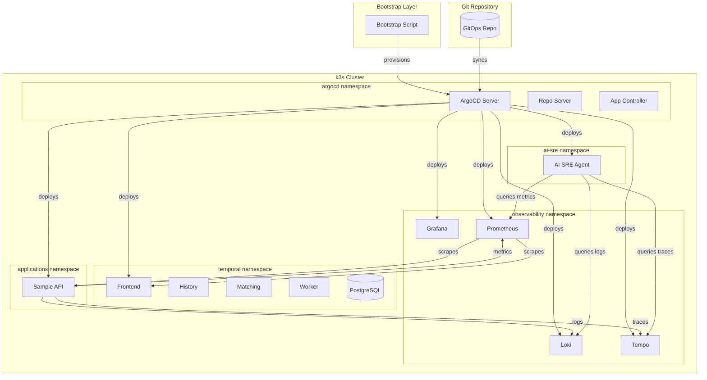

# Local Platform Stack

A production-grade local platform stack running on k3s that demonstrates a complete operational environment: GitOps-managed workloads via ArgoCD, full LGTM observability, Temporal workflow orchestration, a sample instrumented API, and an AI-powered SRE agent for automated root cause analysis.

## Table of Contents

- [Setup Instructions](#setup-instructions)
- [Architecture Overview](#architecture-overview)
- [Design Decisions](#design-decisions)
- [Failure Scenarios and Expected Symptoms](#failure-scenarios-and-expected-symptoms)
- [AI Interaction Log](#ai-interaction-log)
- [Roadmap](#roadmap)

## Setup Instructions

### Prerequisites

| Requirement | Minimum |
|-------------|---------|
| CPU cores | 4 |
| RAM | 8 GB |
| Free disk space | 40 GB |
| Docker | Installed and running |
| k3s | Binary on PATH |
| Helm | v3.x on PATH |

### Quick Start

```bash
# Clone the repository
git clone <repo-url> && cd <repo-name>

# Bootstrap the entire platform
./bootstrap.sh
```

The bootstrap script will:

1. Validate that Docker, k3s, and helm are available on PATH
2. Check for an existing k3s cluster (skips provisioning if found)
3. Install k3s with `--write-kubeconfig-mode 644 --disable traefik`
4. Wait for the node to reach Ready state and system pods to be Running (120s timeout)
5. Install ArgoCD via Helm into the `argocd` namespace
6. Apply the root app-of-apps Application pointing to `gitops/apps/`
7. Wait for all child Applications to reach Synced + Healthy (300s timeout)

### Exit Codes

| Code | Meaning |
|------|---------|
| 0 | Success (provisioned or cluster already exists) |
| 1 | Missing prerequisite (Docker, k3s, or helm not found) |
| 2 | k3s provisioning failed (node not Ready within 120s) |
| 3 | ArgoCD installation failed |
| 4 | ArgoCD sync timeout (Applications not Synced+Healthy within 300s) |

### Post-Bootstrap Verification

```bash
# Verify cluster is ready
k3s kubectl get nodes

# Verify all ArgoCD applications are synced
k3s kubectl get applications -n argocd

# Verify observability stack
k3s kubectl get pods -n observability

# Access Grafana (anonymous access enabled)
k3s kubectl port-forward -n observability svc/grafana 3000:80
# Open http://localhost:3000
```

## Architecture Overview

The platform follows a layered architecture with namespace-per-concern isolation:

1. **Compute Layer** — k3s single-node cluster provisioned via bootstrap script
2. **GitOps Layer** — ArgoCD managing all workloads via app-of-apps pattern
3. **Observability Layer** — Grafana + Loki + Tempo + Prometheus (LGTM)
4. **Orchestration Layer** — Temporal server with workers
5. **Application Layer** — Sample API emitting full telemetry
6. **Intelligence Layer** — AI SRE agent performing automated RCA

### Architecture Diagram



### Namespace Topology

| Namespace | Components | Purpose |
|-----------|-----------|---------|
| `argocd` | Server, Repo Server, App Controller, Redis | GitOps reconciliation |
| `observability` | Grafana, Loki, Tempo, Prometheus | Monitoring and alerting |
| `temporal` | Frontend, History, Matching, Worker, PostgreSQL | Workflow orchestration |
| `applications` | Sample API | Business workloads |
| `ai-sre` | AI SRE Agent, PVC for reports | Automated incident analysis |

### Data Flow

- **Metrics**: Sample API exposes `/metrics` → Prometheus scrapes every 15s → Grafana visualizes
- **Logs**: Sample API writes structured JSON to stdout → Promtail collects → Loki indexes → Grafana queries
- **Traces**: Sample API exports OTLP spans → Tempo ingests via gRPC (4317) / HTTP (4318) → Grafana queries
- **Alerts**: Prometheus evaluates SLO rules → fires alerts on breach (p99 > 500ms for 1m)
- **AI SRE**: Agent polls Prometheus every 30s → detects anomalies → queries Loki/Tempo for evidence → produces RCA report

## Design Decisions

| Decision | Choice | Rationale |
|----------|--------|-----------|
| Kubernetes distribution | k3s | Lightweight, single-binary, production-compatible API, runs on 4 cores/8GB |
| GitOps tool | ArgoCD | Industry standard, app-of-apps pattern, declarative sync |
| Observability stack | Individual Helm charts (not lgtm-distributed) | More control, better resource tuning for local env |
| Metrics backend | Prometheus (not Mimir) | Simpler for single-node, no object storage needed |
| Sample API language | Python (FastAPI) | Unified Python stack with AI SRE Agent, rich OTel support, rapid development |
| AI SRE implementation | Python + LangChain | Rich ecosystem for LLM tooling, easy PromQL/LogQL integration |
| Temporal persistence | PostgreSQL (embedded) | No external DB dependency for local stack |
| Secret management | Kubernetes Secrets + RBAC | Sufficient for local assessment, avoids external vault |
| Failure injection | Shell scripts (not Chaos Mesh) | Zero additional infrastructure, idempotent, reviewable |

## Failure Scenarios and Expected Symptoms

Three failure injection scripts are provided in the `scripts/` directory. Each is executable as a single command with no required parameters, includes a `--cleanup` flag to revert changes, and is idempotent (safe to run multiple times).

### 1. Pod Termination (`scripts/inject-pod-kill.sh`)

Kills the Sample API pod via `kubectl delete pod` with label selector.

| Category | Expected Observable Symptom |
|----------|---------------------------|
| **Metrics affected** | `error_count` spikes immediately; `request_count` drops to zero during restart; pod restart counter increments |
| **Direction of change** | Error rate: sharp increase (0% → 100% during downtime); Request rate: drops to zero then recovers |
| **Log patterns** | `connection refused` errors from clients; pod termination events in kube-system; readiness probe failures during restart |
| **Trace anomalies** | Missing spans during pod downtime; traces show `UNAVAILABLE` or `connection refused` errors on downstream calls |
| **Recovery time** | Pod restarts within 10-30s depending on image pull and readiness probe timing |

```bash
# Inject
./scripts/inject-pod-kill.sh

# Cleanup
./scripts/inject-pod-kill.sh --cleanup
```

### 2. Latency Injection (`scripts/inject-latency.sh`)

Patches the Sample API deployment to add artificial delay (≥2s per request).

| Category | Expected Observable Symptom |
|----------|---------------------------|
| **Metrics affected** | `request_duration_seconds` p99 increases to >2s; `sli:request_latency_p99` recording rule breaches 500ms threshold |
| **Direction of change** | Latency: p99 jumps from baseline (~50ms) to >2000ms; SLO breach alert fires after 1 minute |
| **Log patterns** | Slow request warnings; timeout errors from upstream callers; `SLOLatencyBreach` alert firing in Prometheus logs |
| **Trace anomalies** | All traces show artificially inflated duration (>2s); spans show extended processing time in the service layer |
| **SLO impact** | `SLOLatencyBreach` alert fires within 60s of injection (p99 > 500ms for 1m rule) |

```bash
# Inject
./scripts/inject-latency.sh

# Cleanup
./scripts/inject-latency.sh --cleanup
```

### 3. Resource Pressure (`scripts/inject-resource-pressure.sh`)

Deploys a stress container consuming 80%+ of pod CPU/memory limits.

| Category | Expected Observable Symptom |
|----------|---------------------------|
| **Metrics affected** | CPU throttling metrics increase; memory usage approaches limits; `request_duration_seconds` increases due to throttling |
| **Direction of change** | CPU usage: near 100% of limit; Memory: approaches OOM threshold; Request latency: gradual increase |
| **Log patterns** | OOMKilled events (if memory exceeded); CPU throttling warnings; increased GC pressure logs from application |
| **Trace anomalies** | Increased span durations across all operations; potential timeout spans; irregular timing patterns |
| **Risk indicators** | Pod eviction if node resources exhausted; container restart if OOM limit hit |

```bash
# Inject
./scripts/inject-resource-pressure.sh

# Cleanup
./scripts/inject-resource-pressure.sh --cleanup
```

### Verification After Injection

After injecting a failure, use the following to observe symptoms:

```bash
# Check Prometheus metrics
k3s kubectl port-forward -n observability svc/prometheus 9090:9090
# Query: rate(error_count{service="sample-api"}[1m])

# Check Loki logs
k3s kubectl port-forward -n observability svc/loki 3100:3100
# Query: {namespace="applications"} |= "error"

# Check firing alerts
k3s kubectl exec -n observability deploy/prometheus -- promtool query instant http://localhost:9090 'ALERTS{alertstate="firing"}'

# Check AI SRE Agent RCA reports
k3s kubectl exec -n ai-sre deploy/ai-sre-agent -- ls /reports/
```

## AI Interaction Log

This project documents AI-assisted development through an interaction log. The log captures each development phase with the prompts used, outputs applied, and manual modifications.

### Log Structure

The AI interaction log is organized by development phase:

```
ai-interaction-log/
├── README.md                  # Overview and conventions
├── phase-01-bootstrap.md      # Infrastructure provisioning
├── phase-02-gitops.md         # ArgoCD and app-of-apps setup
├── phase-03-observability.md  # LGTM stack configuration
├── phase-04-temporal.md       # Workflow orchestration
├── phase-05-sample-api.md     # Application development
├── phase-06-ai-sre.md        # AI agent implementation
├── phase-07-security.md      # Network policies and RBAC
├── phase-08-failure-inject.md # Failure injection scripts
└── phase-09-testing.md       # Property and integration tests
```

### Entry Format

Each phase document follows this structure:

```markdown
# Phase N: <Phase Name>

## Session Date: YYYY-MM-DD

### Prompt 1: <Brief Description>

**Prompt:**
> The exact prompt or instruction given to the AI

**Output Applied:**
Summary of the AI-generated code, configuration, or text that was applied to the project.

**Manual Modifications:**
- Description of any changes made to the AI output
- Rationale for modifications
- Files affected

### Prompt 2: <Brief Description>
...
```

### Key Fields

| Field | Description |
|-------|-------------|
| Phase | The development phase (bootstrap, gitops, observability, etc.) |
| Session Date | When the interaction occurred |
| Prompt | The exact instruction or question given to the AI |
| Output Applied | What was taken from the AI response and used |
| Manual Modifications | Human edits to AI output with rationale |
| Files Affected | Which files were created or modified |

## Roadmap

### Completed

- [x] k3s cluster provisioning with automated bootstrap
- [x] ArgoCD GitOps with app-of-apps pattern
- [x] Full LGTM observability stack (Prometheus, Loki, Tempo, Grafana)
- [x] Temporal workflow orchestration with HealthCheckWorkflow
- [x] Sample API with full OpenTelemetry instrumentation
- [x] AI SRE Agent with anomaly detection and RCA generation
- [x] Security hardening (network policies, RBAC, resource limits)
- [x] Failure injection scripts (pod kill, latency, resource pressure)
- [x] Property-based tests for correctness validation
- [x] SLI/SLO definitions with automated alerting

### Future Enhancements

- [ ] **Multi-node cluster** — Expand from single-node k3s to multi-node for HA testing
- [ ] **EKS migration path** — Document and script migration from k3s to EKS
- [ ] **Chaos Mesh integration** — Replace shell scripts with Chaos Mesh for richer failure injection (network partition, disk I/O, clock skew)
- [ ] **Custom SLO dashboards** — Build multi-window, multi-burn-rate SLO dashboards in Grafana
- [ ] **Alertmanager integration** — Route alerts to Slack/PagerDuty for realistic incident management
- [ ] **Horizontal Pod Autoscaler** — Demonstrate auto-scaling based on custom metrics
- [ ] **Service mesh (Istio/Linkerd)** — Add mTLS and traffic management capabilities
- [ ] **Cost optimization analysis** — Resource right-sizing recommendations based on observed usage
- [ ] **Multi-tenant isolation** — Demonstrate namespace-level tenant separation with quotas
- [ ] **GitOps promotion pipeline** — Implement dev → staging → prod promotion via ArgoCD ApplicationSets

